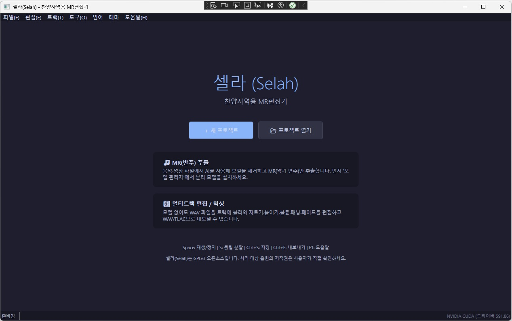
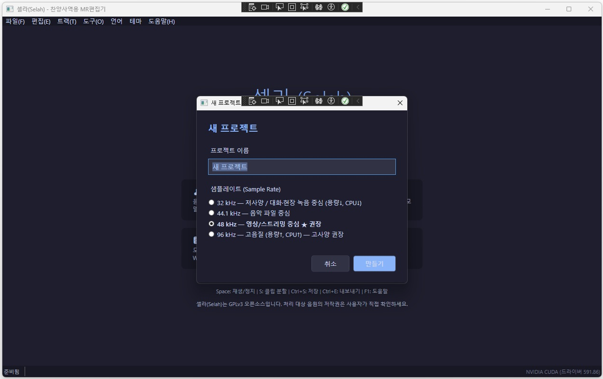
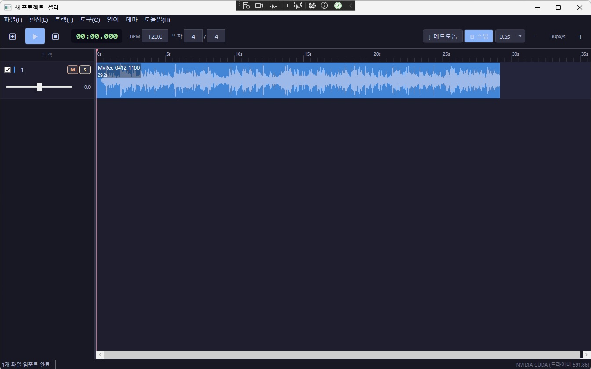
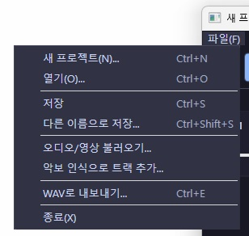
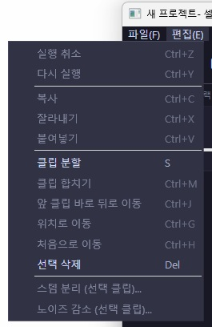
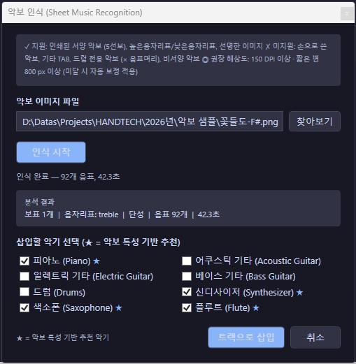
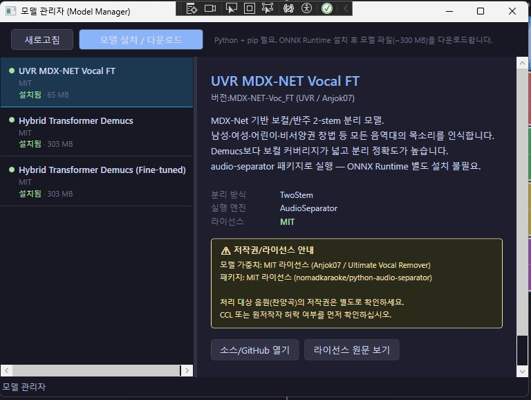

# Selah

**Selah** is a Windows desktop application for worship music preparation, project-based audio arrangement, and AI-assisted stem separation.

It is designed to help churches, missionaries, and small worship teams prepare accompaniment-oriented audio materials from recordings or worship media in a practical and accessible way.

> Version 1.0

**한국어 / Korean** | **English**

---

## Screenshots

| Welcome Screen | New Project |
|:--------------:|:-----------:|
|  |  |

| Main Editor |
|:-----------:|
|  |

| File Menu | Edit Menu |
|:---------:|:---------:|
|  |  |

| Sheet Music Recognition | Model Manager |
|:-----------------------:|:-------------:|
|  |  |

---

## Overview

Selah combines three main ideas into one workflow:

- **project-based worship audio preparation**
- **timeline-oriented clip and track arrangement**
- **AI-assisted stem separation from audio recordings**

The application is currently implemented as a **WPF desktop app** with a shared core library for audio, project, and separation services.

---

## Main Goals

Selah aims to support:

- worship preparation for small churches and pioneer churches
- missionary and ministry-oriented audio workflows
- accompaniment preparation from worship recordings
- reusable project-based arrangement of separated stems
- simple local workflows without requiring cloud services

This project is being built as a **free and open-source tool** for non-commercial ministry-oriented use.

---

## Current Features

The repository currently includes:

- WPF desktop application (`Selah.App`)
- shared core library (`Selah.Core`)
- project / track / clip data model
- timeline-related UI and view models
- audio engine / mixer-related components
- waveform cache support
- FFmpeg / FFprobe wrapper service
- hardware detection service
- model management service
- stem separation service (audio-separator, ONNX Runtime, Demucs backends)
- noise reduction service
- **sheet music recognition** — scanned/photographed score → per-instrument audio tracks (OMR via oemer + FluidSynth synthesis)
- localization resources (Korean / English / Chinese)
- theme resources (light / dark)
- **non-destructive clip editing** — copy / cut / paste / split / merge
- **multi-clip selection** — Ctrl+click toggle, Shift+click range; split and move operations apply to all selected clips
- **clip positioning commands** — move after previous clip, move to playhead position, move to track start

---

## Keyboard Shortcuts

### Transport

| Key | Action |
|-----|--------|
| `Space` | Play / Stop |
| `Shift+Space` | Stop + Return to Start |
| `Home` | Return to Start (keep playing if active) |

### Timeline Editing

| Key | Action |
|-----|--------|
| `S` | Split selected clip(s) at playhead |
| `Del` | Delete selected clip(s) or track |
| `Ctrl+C` | Copy selected clip(s) |
| `Ctrl+X` | Cut selected clip(s) |
| `Ctrl+V` | Paste |
| `Ctrl+M` | Merge selected clips (same track) |
| `Ctrl+J` | Move after previous clip |
| `Ctrl+G` | Move to playhead position |
| `Ctrl+H` | Move to track start (position 0) |

### Mouse

| Action | Result |
|--------|--------|
| Click clip | Select clip |
| Ctrl+Click clip | Toggle clip selection |
| Shift+Click clip | Range select |
| Drag clip | Move clip |
| Click timeline ruler | Seek playhead |
| Ctrl+Scroll | Zoom in / out |

---

## Release History

See **[HISTORY.md](HISTORY.md)** for a full version changelog.

---

## Installation

### Step 1 — Download the installer

**[▶ Download from the Releases page](https://github.com/elrang3843/Selah/releases/latest)**

Click `Selah-1.0.0-Setup.exe` to download.

> If Windows Defender SmartScreen appears, click **"More info" → "Run anyway"**.

### Step 2 — Run the installer

1. Run `Selah-1.0.0-Setup.exe`.
2. Select installation language.
3. Confirm the installation path and click **Install**.
4. When finished, an optional **"Install Python packages"** checkbox appears — check it if you plan to use AI features, then click **Finish**.

> **.NET runtime is bundled** — no separate download needed.

### Step 3 — Install Python packages (AI features)

Required for stem separation, noise reduction, and sheet music recognition.

**Install Python 3.10+** from <https://www.python.org/downloads/>  
(check **"Add Python to PATH"** during setup)

Then run `setup_env.bat` from the install folder (default: `C:\Program Files\Selah\`):

```
C:\Program Files\Selah\setup_env.bat
```

Or install directly:

```bat
pip install -r "C:\Program Files\Selah\requirements.txt"
```

### Step 4 — FFmpeg (non-WAV formats)

Required to import/export MP3, MP4, FLAC, and other non-WAV formats.

1. Download a Windows build from <https://ffmpeg.org/download.html>
2. Extract and add the `bin\` folder (containing `ffmpeg.exe`) to your system PATH.
3. Verify: `ffmpeg -version`

### Step 5 — FluidSynth + SoundFont (sheet music only)

Skip if you do not use the sheet music recognition feature.

1. Install FluidSynth from <https://www.fluidsynth.org/> (provides `libfluidsynth-3.dll`)
2. Place a SoundFont (`.sf2` / `.sf3`) in `%AppData%\Selah\soundfonts\`

**Recommended SoundFonts:**

| SoundFont | Size | Quality | License |
|-----------|------|---------|---------|
| **GeneralUser GS** ★ | ~29 MB | ★★★★☆ | Free |
| MuseScore_General.sf3 | ~50 MB | ★★★★★ | MIT |

### Installation Summary

| Feature | Requires |
|---------|----------|
| Basic playback & editing | Installer only |
| Import MP3 / MP4 | FFmpeg |
| Stem separation | Python 3.10+ · `audio-separator` or `onnxruntime` |
| Noise reduction | Python 3.10+ · `noisereduce` |
| Sheet music recognition | Python 3.10+ · `oemer` · FluidSynth · SoundFont |

Full guide: **[docs/SETUP.md](docs/SETUP.md)**

---

## Repository Structure

```text
Selah.sln
├─ src/
│  ├─ Selah.App/               # WPF application
│  └─ Selah.Core/              # audio engine, models, services
├─ scripts/
│  ├─ sheet_music_runner.py    # OMR pipeline (oemer + music21)
│  ├─ midi_synthesizer.py      # MIDI → WAV via FluidSynth
│  ├─ demucs_runner.py         # Demucs stem separation
│  ├─ onnx_runner.py           # ONNX stem separation
│  ├─ audio_separator_runner.py
│  └─ noise_reducer.py
├─ docs/
│  ├─ SETUP.md                 # dependency installation guide
│  ├─ SETUP.ko.md
│  ├─ ETHICS.md
│  ├─ TRADEMARK.md
│  ├─ ETHICS.ko.md
│  └─ TRADEMARK.ko.md
├─ README.md                   # KO+EN combined
├─ README.en.md                # This file (English only)
├─ README.ko.md                # Korean only
├─ LICENSE
└─ THIRD_PARTY_NOTICES.md
