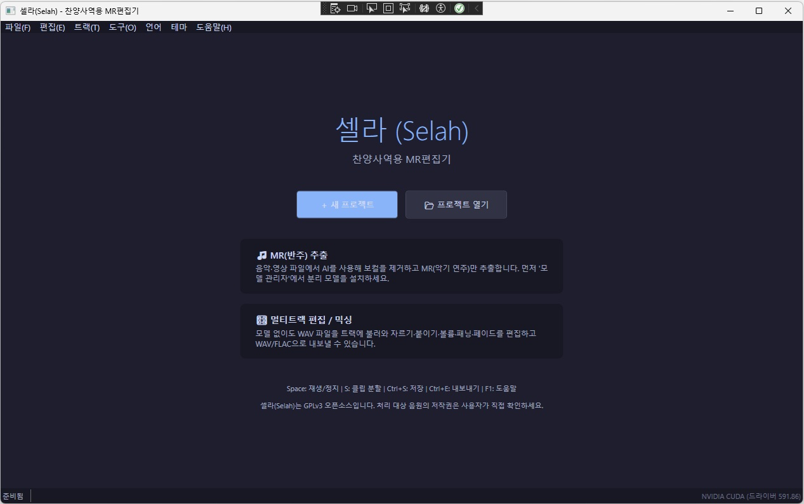
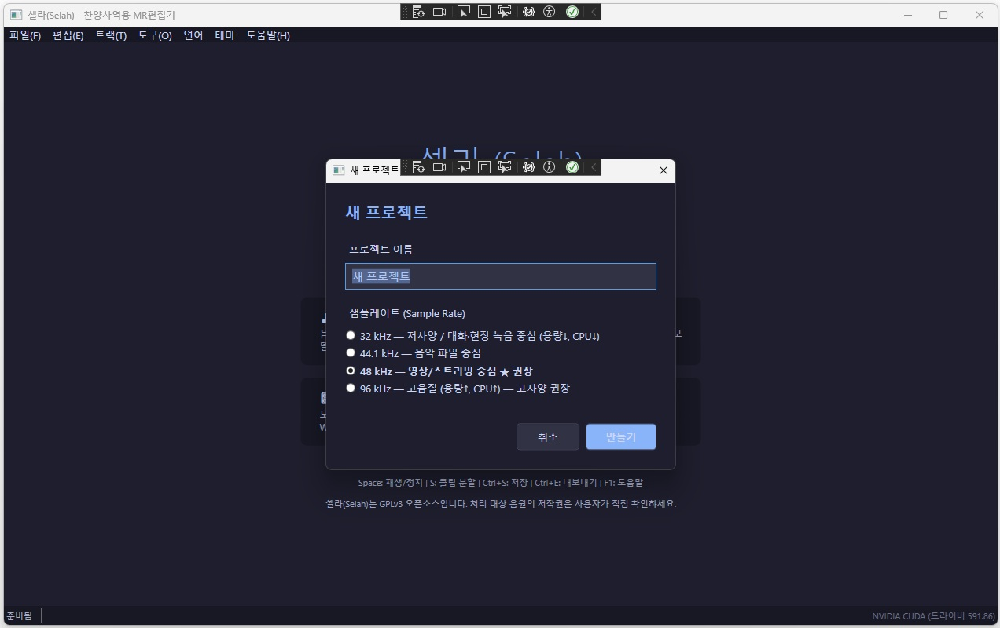
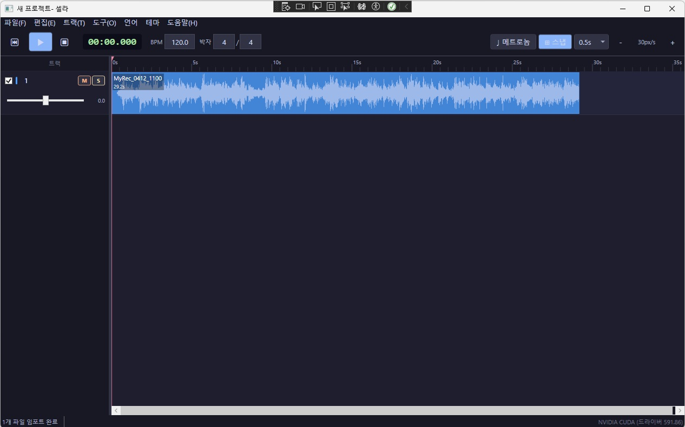
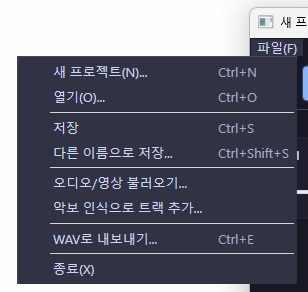
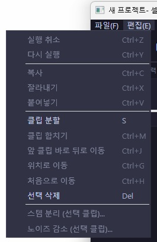
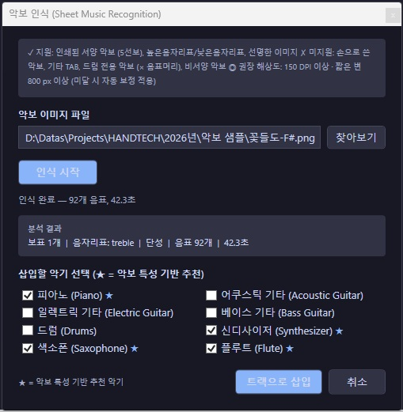
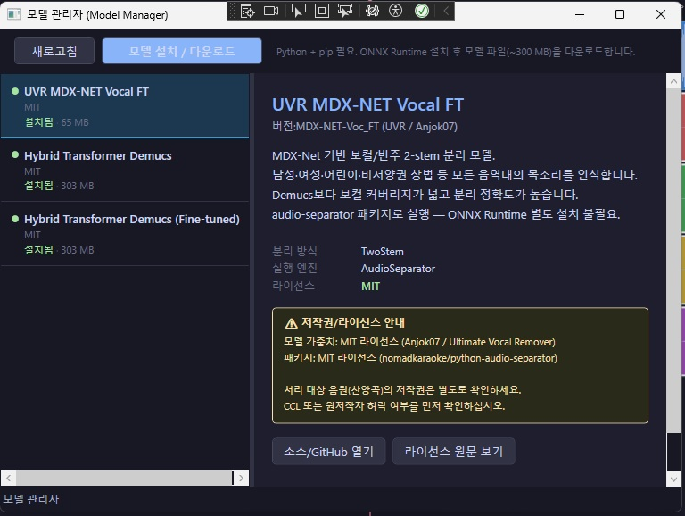

# Selah

**Selah** is a Windows desktop application for worship music preparation, project-based audio arrangement, and AI-assisted stem separation.

It is designed to help churches, missionaries, and small worship teams prepare accompaniment-oriented audio materials from recordings or worship media in a practical and accessible way.

> Version 1.0

---

## Screenshots

| Welcome Screen | New Project |
|:--------------:|:-----------:|
|  |  |

| Main Editor |
|:-----------:|
|  |

| File Menu | Edit Menu |
|:---------:|:---------:|
|  |  |

| Sheet Music Recognition | Model Manager |
|:-----------------------:|:-------------:|
|  |  |

---

## Overview

Selah combines three main ideas into one workflow:

- **project-based worship audio preparation**
- **timeline-oriented clip and track arrangement**
- **AI-assisted stem separation from audio recordings**

The application is currently implemented as a **WPF desktop app** with a shared core library for audio, project, and separation services.

---

## Main Goals

Selah aims to support:

- worship preparation for small churches and pioneer churches
- missionary and ministry-oriented audio workflows
- accompaniment preparation from worship recordings
- reusable project-based arrangement of separated stems
- simple local workflows without requiring cloud services

This project is being built as a **free and open-source tool** for non-commercial ministry-oriented use.

---

## Current Features

The repository currently includes:

- WPF desktop application (`Selah.App`)
- shared core library (`Selah.Core`)
- project / track / clip data model
- timeline-related UI and view models
- audio engine / mixer-related components
- waveform cache support
- FFmpeg / FFprobe wrapper service
- hardware detection service
- model management service
- stem separation service (audio-separator, ONNX Runtime, Demucs backends)
- noise reduction service
- **sheet music recognition** — scanned/photographed score → per-instrument audio tracks (OMR via oemer + FluidSynth synthesis)
- localization resources (Korean / English / Chinese)
- theme resources (light / dark)
- **non-destructive clip editing** — copy / cut / paste / split / merge
- **multi-clip selection** — Ctrl+click toggle, Shift+click range; split and move operations apply to all selected clips
- **clip positioning commands** — move after previous clip, move to playhead position, move to track start

---

## Keyboard Shortcuts

### Transport

| Key | Action |
|-----|--------|
| `Space` | Play / Stop |
| `Shift+Space` | Stop + Return to Start |
| `Home` | Return to Start (keep playing if active) |

### Timeline Editing

| Key | Action |
|-----|--------|
| `S` | Split selected clip(s) at playhead |
| `Del` | Delete selected clip(s) or track |
| `Ctrl+C` | Copy selected clip(s) |
| `Ctrl+X` | Cut selected clip(s) |
| `Ctrl+V` | Paste |
| `Ctrl+M` | Merge selected clips (same track) |
| `Ctrl+J` | Move after previous clip |
| `Ctrl+G` | Move to playhead position |
| `Ctrl+H` | Move to track start (position 0) |

### Mouse

| Action | Result |
|--------|--------|
| Click clip | Select clip |
| Ctrl+Click clip | Toggle clip selection |
| Shift+Click clip | Range select |
| Drag clip | Move clip |
| Click timeline ruler | Seek playhead |
| Ctrl+Scroll | Zoom in / out |

---

## Release History

See **[HISTORY.md](HISTORY.md)** for a full version changelog.

---

## Installation & Dependencies

See **[docs/SETUP.md](docs/SETUP.md)** for a full guide covering:

- .NET 8 runtime and Python 3.10+
- FFmpeg for audio import/export
- Python packages for stem separation, noise reduction, and sheet music recognition
- FluidSynth and SoundFont (.sf2/.sf3) for MIDI synthesis — recommended: **GeneralUser GS** (~29 MB, free) or **MuseScore_General.sf3** (~50 MB, MIT, best quality)

---

## Repository Structure

```text
Selah.sln
├─ src/
│  ├─ Selah.App/               # WPF application
│  └─ Selah.Core/              # audio engine, models, services
├─ scripts/
│  ├─ sheet_music_runner.py    # OMR pipeline (oemer + music21)
│  ├─ midi_synthesizer.py      # MIDI → WAV via FluidSynth
│  ├─ demucs_runner.py         # Demucs stem separation
│  ├─ onnx_runner.py           # ONNX stem separation
│  ├─ audio_separator_runner.py
│  └─ noise_reducer.py
├─ docs/
│  ├─ SETUP.md                 # dependency installation guide
│  ├─ SETUP.ko.md
│  ├─ ETHICS.md
│  ├─ TRADEMARK.md
│  ├─ ETHICS.ko.md
│  └─ TRADEMARK.ko.md
├─ README.md
├─ README.ko.md
├─ LICENSE
└─ THIRD_PARTY_NOTICES.md
