# 셀라 (Selah) 사용자 매뉴얼

**찬양사역용 MR편집기** · v1.0.0  
저작권자: HANDTECH 노진문(Noh JinMoon) · GPLv3

---

## 목차

1. [시작하기](#1-시작하기)
2. [새 프로젝트 만들기](#2-새-프로젝트-만들기)
3. [메인 편집 화면](#3-메인-편집-화면)
4. [파일 메뉴](#4-파일-메뉴)
5. [편집 메뉴](#5-편집-메뉴)
6. [트랙 메뉴 / 도구 메뉴](#6-트랙-메뉴--도구-메뉴)
7. [언어 및 테마](#7-언어-및-테마)
8. [오디오 가져오기](#8-오디오-가져오기)
9. [클립 편집](#9-클립-편집)
10. [MR(반주) 추출 — 스템 분리](#10-mr반주-추출--스템-분리)
11. [악보 인식으로 트랙 추가](#11-악보-인식으로-트랙-추가)
12. [내보내기](#12-내보내기)
13. [도움말](#13-도움말)
14. [단축키 전체 목록](#14-단축키-전체-목록)

---

## 1. 시작하기

프로그램을 실행하면 시작 화면이 나타납니다.

- **+ 새 프로젝트** — 새 편집 프로젝트를 만듭니다.
- **프로젝트 열기** — 기존 `.slh` 프로젝트 파일을 불러옵니다.

화면 하단에는 주요 단축키 안내와 라이선스 정보가 표시됩니다.  
오른쪽 하단에는 현재 감지된 GPU 정보(예: `NVIDIA CUDA`)가 표시됩니다.

---

## 2. 새 프로젝트 만들기

**+ 새 프로젝트**를 클릭하면 대화상자가 열립니다.

### 프로젝트 이름
원하는 이름을 입력합니다. 기본값은 "새 프로젝트"입니다.

### 샘플레이트(Sample Rate) 선택

| 옵션 | 용도 |
|------|------|
| 32 kHz | 저사양 PC · 대화/현장 녹음 중심 (용량↓, CPU↓) |
| 44.1 kHz | 음악 파일 중심 (CD 표준) |
| **48 kHz ★ 권장** | 영상/스트리밍 중심 — 대부분의 경우 이 설정 사용 |
| 96 kHz | 고음질 작업 (용량↑, CPU↑) — 고사양 권장 |

**만들기**를 클릭하면 메인 편집 화면으로 이동합니다.

---

## 3. 메인 편집 화면

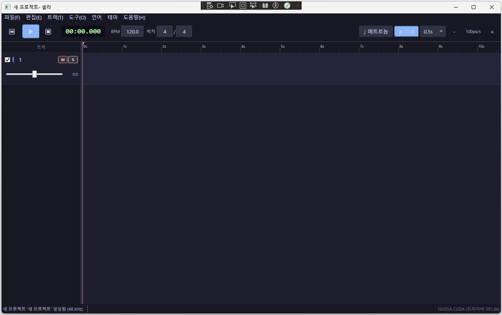

### 트랜스포트 바 (상단)

| 버튼/항목 | 설명 |
|-----------|------|
| ⏮ (처음으로) | 플레이헤드를 맨 앞으로 이동 |
| ▶ (재생/정지) | 재생 시작 또는 정지 (`Space`) |
| ⏹ (정지+처음으로) | 정지하고 처음으로 이동 (`Shift+Space`) |
| 시간 표시 (`00:00.000`) | 현재 플레이헤드 위치 (분:초.밀리초) |
| BPM | 프로젝트 템포 (기본 120) |
| 박자 | 박자표 (기본 4/4) |
| ♩ 메트로놈 | 메트로놈 켜기/끄기 (`M`) |
| 스냅 | 스냅 켜기/끄기 및 스냅 간격 설정 (`N`) |
| px/s · +/− | 타임라인 확대/축소 (`Ctrl+스크롤`) |

### 트랙 헤더 (왼쪽)

| 요소 | 설명 |
|------|------|
| 체크박스 | 트랙 활성화/비활성화 |
| 트랙 번호 | 트랙 이름 |
| **M** | 뮤트(Mute) — 이 트랙을 재생에서 제외 |
| **S** | 솔로(Solo) — 이 트랙만 재생 |
| 슬라이더 | 볼륨 조절 |
| 숫자 (0.0) | 현재 볼륨 값 (dB) |

### 타임라인 (오른쪽)

- 상단 눈금자를 **클릭**하면 플레이헤드가 해당 위치로 이동합니다.
- **Ctrl+스크롤**로 확대/축소합니다.
- 클립을 **드래그**하면 이동합니다.
- **Ctrl+클릭**으로 클립을 개별 선택하거나 해제합니다.
- **Shift+클릭**으로 범위 선택합니다.

### 상태바 (하단)

- 왼쪽: 현재 작업 상태 메시지
- 오른쪽: GPU/드라이버 정보

---

## 4. 파일 메뉴

| 메뉴 항목 | 단축키 | 설명 |
|-----------|--------|------|
| 새 프로젝트(N)... | Ctrl+N | 새 프로젝트 대화상자 열기 |
| 열기(O)... | Ctrl+O | 기존 `.slh` 프로젝트 파일 열기 |
| 저장 | Ctrl+S | 현재 프로젝트 저장 |
| 다른 이름으로 저장... | Ctrl+Shift+S | 다른 이름/위치로 저장 |
| 오디오/영상 불러오기... | — | WAV, MP3, MP4 등 오디오/영상 파일을 트랙에 추가 |
| 악보 인식으로 트랙 추가... | — | 악보 이미지를 인식해 악기별 오디오 트랙으로 추가 |
| WAV로 내보내기... | Ctrl+E | 전체 타임라인을 WAV/FLAC 파일로 내보내기 |
| 종료(X) | — | 프로그램 종료 |

> **프로젝트 파일(.slh)** — 셀라 전용 프로젝트 형식입니다. gzip으로 압축된 JSON 파일이며, 원본 오디오는 프로젝트 폴더의 `audio/` 서브폴더에 저장됩니다.

### 프로젝트 열기 대화상자

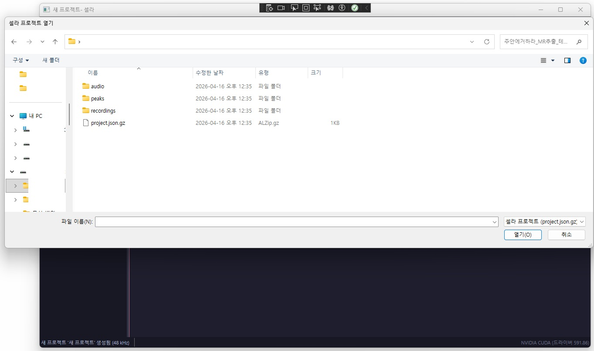

프로젝트 폴더 안에는 `audio/`, `peaks/`, `recordings/` 폴더와 `project.json.gz` 파일이 있습니다.

---

## 5. 편집 메뉴

| 메뉴 항목 | 단축키 | 설명 |
|-----------|--------|------|
| 실행 취소 | Ctrl+Z | 최근 작업 취소 (준비 중) |
| 다시 실행 | Ctrl+Y | 취소한 작업 다시 실행 (준비 중) |
| 복사 | Ctrl+C | 선택한 클립 복사 |
| 잘라내기 | Ctrl+X | 선택한 클립 잘라내기 |
| 붙여넣기 | Ctrl+V | 복사/잘라낸 클립 붙여넣기 |
| 클립 분할 | S | 플레이헤드 위치에서 선택 클립 분할 |
| 클립 합치기 | Ctrl+M | 같은 트랙의 선택 클립들을 하나로 합치기 |
| 앞 클립 바로 뒤로 이동 | Ctrl+J | 선택 클립을 같은 트랙의 앞 클립 바로 뒤에 붙이기 |
| 위치로 이동 | Ctrl+G | 선택 클립을 현재 플레이헤드 위치로 이동 |
| 처음으로 이동 | Ctrl+H | 선택 클립을 트랙의 시작 위치(0)로 이동 |
| 선택 삭제 | Del | 선택한 클립 또는 트랙 삭제 |
| 스템 분리 (선택 클립)... | — | AI로 보컬/반주 분리 |
| 노이즈 감소 (선택 클립)... | — | 선택 클립의 배경 소음 제거 |

---

## 6. 트랙 메뉴 / 도구 메뉴

### 트랙 메뉴

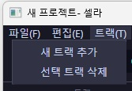

| 메뉴 항목 | 설명 |
|-----------|------|
| 새 트랙 추가 | 빈 트랙을 타임라인에 추가 |
| 선택 트랙 삭제 | 현재 선택된 트랙을 삭제 |

### 도구 메뉴

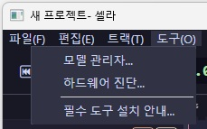

| 메뉴 항목 | 설명 |
|-----------|------|
| 모델 관리자... | 스템 분리 AI 모델을 설치/다운로드 |
| 하드웨어 진단... | CPU/GPU 정보 및 ML 가속 지원 여부 확인 |
| 필수 도구 설치 안내... | 설치 가이드 문서를 브라우저에서 열기 |

---

## 7. 언어 및 테마

### 언어 변경

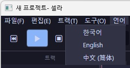

**언어** 메뉴에서 한국어 / English / 中文(简体)을 선택할 수 있습니다. 변경 즉시 메뉴와 UI 전체에 적용됩니다.

| 영문 UI |
|:-------:|
| 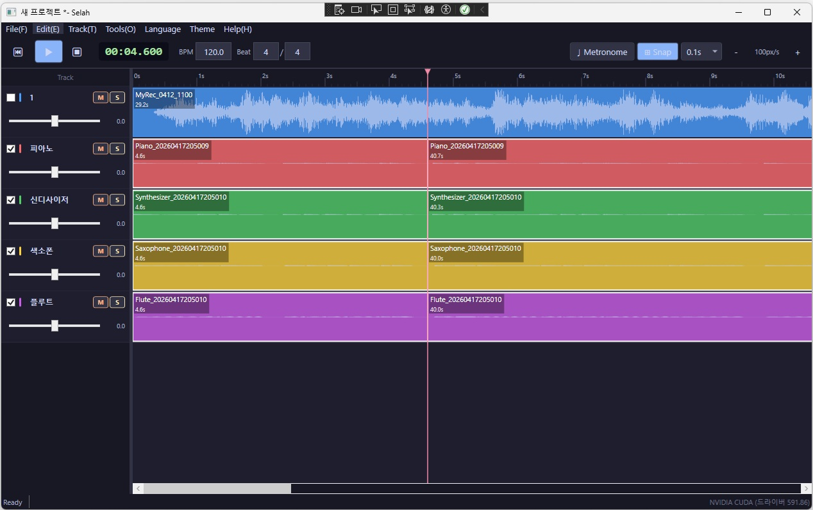 |

| 중문 UI |
|:-------:|
|  |

### 테마 변경

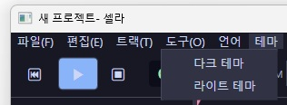

**테마** 메뉴에서 다크 테마 / 라이트 테마를 선택할 수 있습니다.

| 라이트 테마 |
|:-----------:|
| 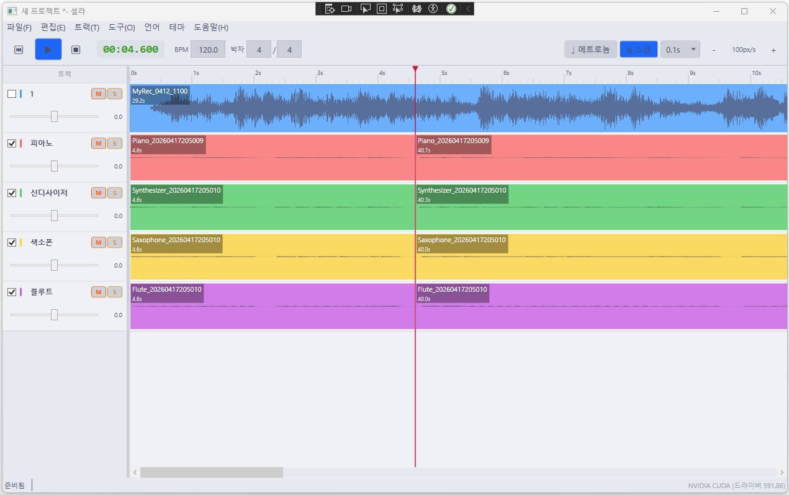 |

---

## 8. 오디오 가져오기

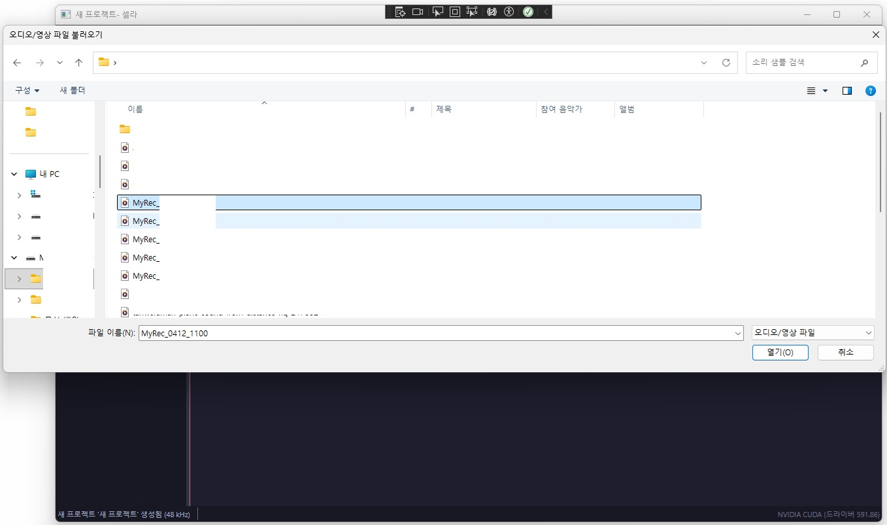

1. **파일 → 오디오/영상 불러오기...** 를 선택합니다.
2. 파일 탐색기에서 오디오(WAV, MP3, FLAC, AAC 등) 또는 영상(MP4, MKV 등) 파일을 선택합니다.
3. 선택한 파일이 자동으로 새 트랙에 추가됩니다.

> FFmpeg가 설치되어 있어야 MP3, MP4 등 비-WAV 형식을 가져올 수 있습니다.  
> 설치 방법은 **도움말 → 필수 도구 설치 안내**를 참조하세요.

---

## 9. 클립 편집

### 클립 선택

- **클릭**: 단일 클립 선택
- **Ctrl+클릭**: 클립 선택 추가/해제
- **Shift+클릭**: 첫 선택 클립부터 클릭한 클립까지 범위 선택

### 클립 이동

- 클립을 **드래그**하여 이동합니다.
- **스냅** 기능이 켜져 있으면 클립이 특정 간격에 맞춰 붙습니다.

### 클립 분할

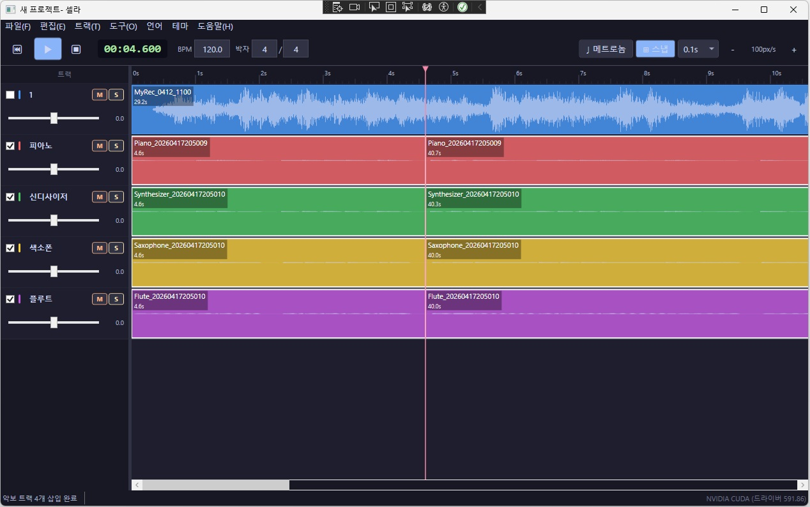

1. 플레이헤드를 분할할 위치로 이동합니다.
2. 분할할 클립을 선택합니다 (다중 선택 가능).
3. `S` 키를 누릅니다.

### 클립 합치기 (Ctrl+M)

1. 같은 트랙에서 붙어있는 클립들을 선택합니다.
2. `Ctrl+M`을 누릅니다.

### 클립 위치 이동 명령

| 명령 | 단축키 | 설명 |
|------|--------|------|
| 앞 클립 바로 뒤로 이동 | Ctrl+J | 앞 클립 끝에 붙여 이음새 없이 배치 |
| 플레이헤드 위치로 이동 | Ctrl+G | 선택 그룹을 플레이헤드가 있는 위치로 이동 |
| 트랙 시작으로 이동 | Ctrl+H | 선택 그룹을 트랙 맨 앞(위치 0)으로 이동 |

---

## 10. MR(반주) 추출 — 스템 분리

AI를 사용해 음악 파일에서 보컬을 제거하고 반주(MR)만 추출합니다.

### 사용 방법

1. 원본 음악 파일을 트랙에 불러옵니다.
2. 해당 클립을 선택합니다.
3. **편집 → 스템 분리 (선택 클립)...** 를 선택합니다.
4. 분리 엔진과 분리 방식을 선택합니다.
5. 분리가 완료되면 결과 트랙이 자동으로 추가됩니다.

### 분리 엔진

| 엔진 | 특징 |
|------|------|
| audio-separator (MDX-Net) | 보컬 분리 품질 최우수, 기본 권장 |
| ONNX Runtime | GPU 불필요, 경량 |
| Demucs | GPU 가속 시 최고 품질 |

### 모델 관리자

> **도구 → 모델 관리자**에서 분리 모델을 설치하거나 삭제할 수 있습니다.

| UVR MDX-NET Vocal FT | Hybrid Transformer Demucs |
|:--------------------:|:-------------------------:|
|  | 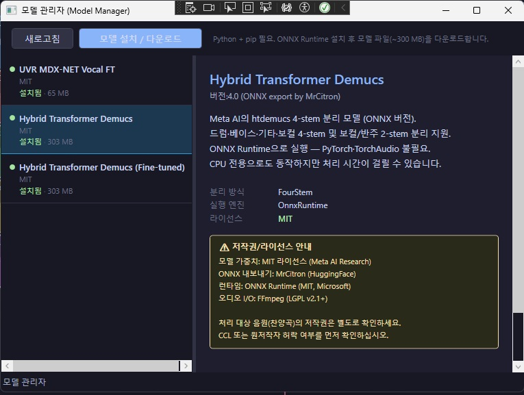 |

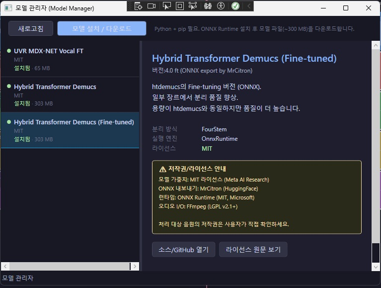

> Python 3.10 이상이 필요합니다.

---

## 11. 악보 인식으로 트랙 추가

스캔하거나 촬영한 악보 이미지에서 악기별 오디오 트랙을 자동 생성합니다.

### 사용 방법

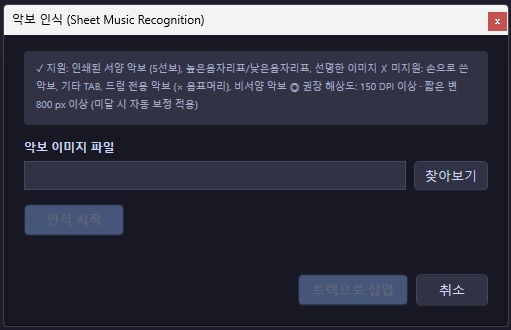

1. **파일 → 악보 인식으로 트랙 추가...** 를 선택합니다.
2. 악보 이미지 파일(JPG, PNG 등)을 선택합니다.

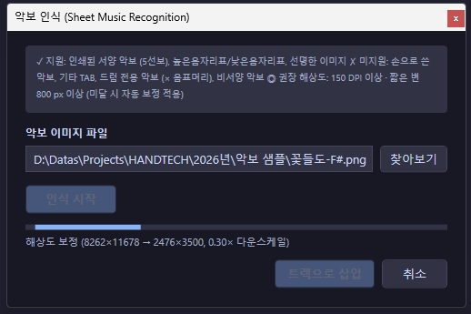

3. **인식 시작**을 클릭하면 OMR 분석이 시작됩니다.

4. 인식이 완료되면 악기 선택 화면이 나타납니다.  
   ★ 표시는 악보 특성 기반 추천 악기입니다.
5. 원하는 악기를 선택하고 **트랙으로 삽입**을 클릭합니다.

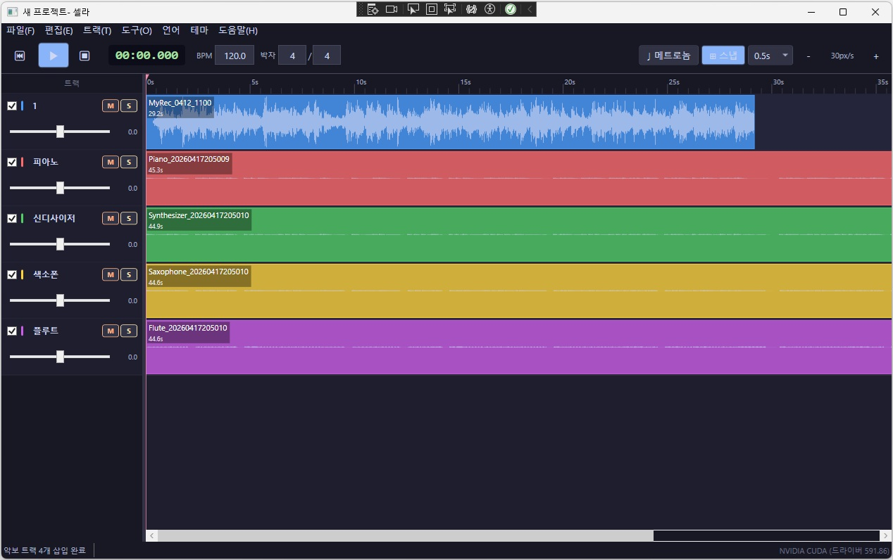

선택한 악기별로 오디오 트랙이 자동 생성됩니다.

### 요구사항

- **FluidSynth** 및 **SoundFont** 파일 (`.sf2` 또는 `.sf3`)
- **Python 패키지**: `oemer`, `mido`
- 권장 SoundFont: GeneralUser GS 또는 MuseScore_General.sf3

> 설치 방법은 **도움말 → 필수 도구 설치 안내**를 참조하세요.

---

## 12. 내보내기

완성된 편집물을 오디오 파일로 저장합니다.

1. **파일 → WAV로 내보내기...** (`Ctrl+E`)를 선택합니다.
2. 저장 위치와 파일명을 지정합니다.
3. 형식(WAV/FLAC)과 비트 심도를 선택합니다.
4. **내보내기**를 클릭합니다.

> 솔로/뮤트 상태가 반영됩니다. 내보내기 전에 원하는 트랙만 활성화되어 있는지 확인하세요.

---

## 13. 도움말

**도움말** 메뉴 또는 `F1` 키를 누르면 도움말 창이 열립니다.

| 단축키 목록 | 사용 가이드 |
|:-----------:|:-----------:|
| 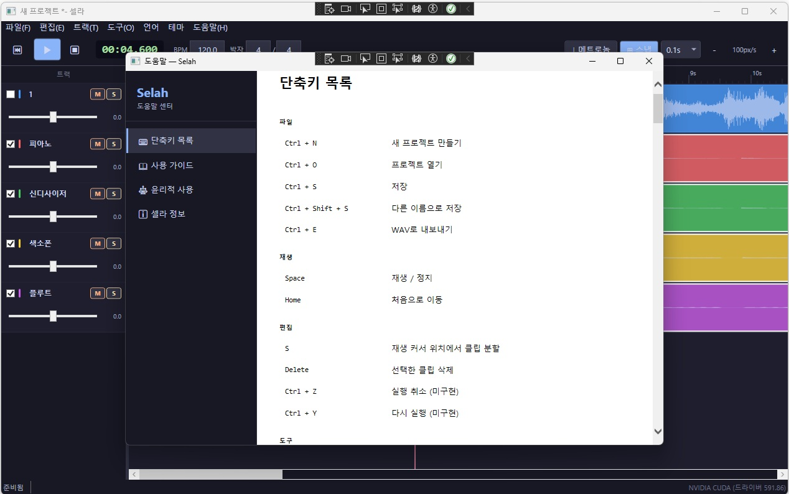 | 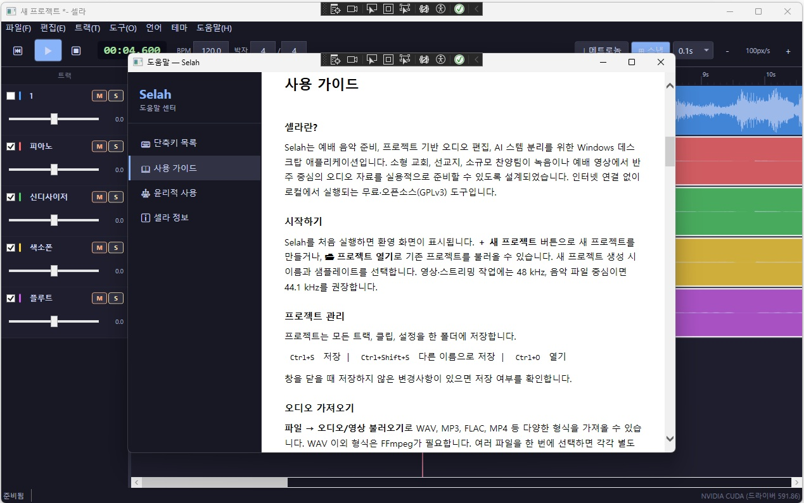 |

| 윤리적 사용 | 셀라 정보 |
|:-----------:|:---------:|
| 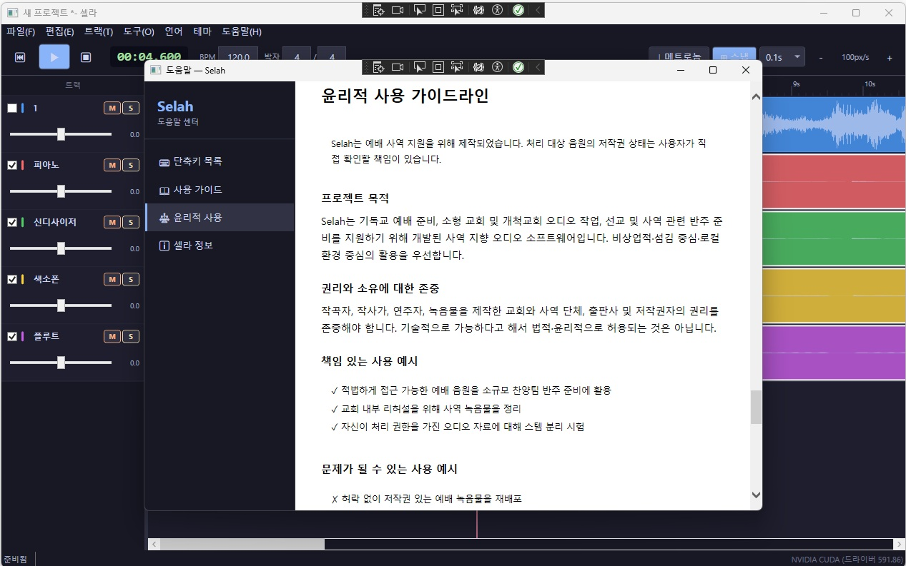 | 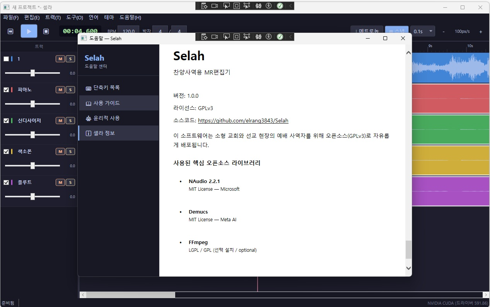 |

### 도움말 메뉴

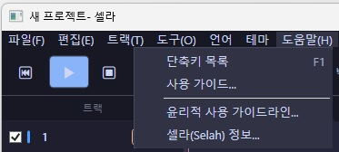

| 항목 | 설명 |
|------|------|
| 단축키 목록 | 키보드 단축키 전체 목록 |
| 사용 가이드 | 기능 및 사용법 안내 |
| 윤리적 사용 가이드라인 | 저작권 및 사용 주의사항 |
| 셀라(Selah) 정보 | 버전, 라이선스, 오픈소스 라이브러리 정보 |

---

## 14. 단축키 전체 목록

### 트랜스포트

| 키 | 동작 |
|----|------|
| `Space` | 재생 / 정지 |
| `Shift+Space` | 정지 + 처음으로 |
| `Home` | 처음으로 (재생 중이면 재생 유지) |
| `M` | 메트로놈 켜기/끄기 |
| `N` | 스냅 켜기/끄기 |

### 파일

| 키 | 동작 |
|----|------|
| `Ctrl+N` | 새 프로젝트 |
| `Ctrl+O` | 열기 |
| `Ctrl+S` | 저장 |
| `Ctrl+Shift+S` | 다른 이름으로 저장 |
| `Ctrl+E` | WAV로 내보내기 |

### 편집

| 키 | 동작 |
|----|------|
| `Ctrl+C` | 복사 |
| `Ctrl+X` | 잘라내기 |
| `Ctrl+V` | 붙여넣기 |
| `S` | 클립 분할 |
| `Ctrl+M` | 클립 합치기 |
| `Ctrl+J` | 앞 클립 바로 뒤로 이동 |
| `Ctrl+G` | 플레이헤드 위치로 이동 |
| `Ctrl+H` | 트랙 시작으로 이동 |
| `Del` | 선택 삭제 |

### 타임라인 마우스 조작

| 동작 | 결과 |
|------|------|
| 클립 클릭 | 단일 선택 |
| `Ctrl`+클릭 | 선택 추가/해제 |
| `Shift`+클릭 | 범위 선택 |
| 클립 드래그 | 이동 |
| 눈금자 클릭 | 플레이헤드 이동 |
| `Ctrl`+스크롤 | 확대/축소 |
| `F1` | 도움말 열기 |

---

*셀라(Selah)는 GPLv3 오픈소스입니다. 처리 대상 음원의 저작권은 사용자가 직접 확인하세요.*
